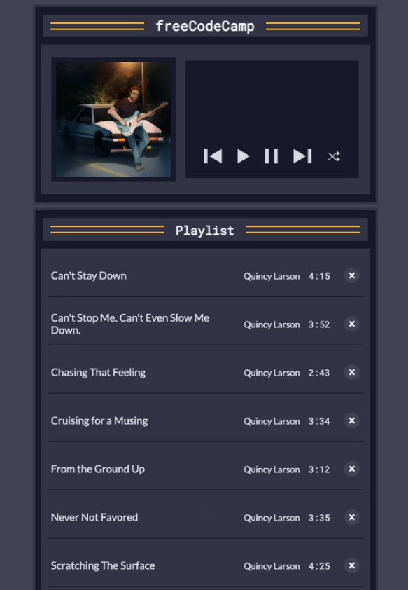

Here is a **`README.md`** file for your project:

```markdown
# Music Player App

A simple and interactive music player web application built using HTML, CSS, and JavaScript. It allows users to play, pause, shuffle, and navigate through a playlist of songs with ease.

## Features

- **Play/Pause Songs:** Play your favorite songs or pause the playback.
- **Next/Previous Navigation:** Move to the next or previous song in the playlist.
- **Shuffle:** Shuffle the playlist for a random listening experience.
- **Delete Songs:** Remove songs from the playlist dynamically.
- **Reset Playlist:** Reset the playlist to its original state after deleting songs.
- **Dynamic Display:** Displays the currently playing song's title and artist.
- **Accessible Design:** Fully accessible with ARIA labels for screen readers.

## Demo



## Setup and Usage

1. Clone the repository or download the files:
   ```bash
   git clone https://github.com/yourusername/music-player-app.git
   cd music-player-app
   ```

2. Open the `index.html` file in your favorite web browser:
   ```bash
   open index.html
   ```

3. Enjoy your music!

## Project Structure

```
├── index.html    # Main HTML file
├── styles.css    # Styling for the app
├── script.js     # JavaScript functionality
```

### `script.js`

The main logic for handling the player actions is written in JavaScript. It includes:
- Functions to play, pause, shuffle, and delete songs.
- Event listeners for buttons to handle user interactions.
- Functions to dynamically update the playlist display.

### `styles.css`

Contains the styling for the music player app, including:
- A responsive and visually appealing layout.
- Styling for buttons and playlist items.
- Custom fonts and colors.

## How It Works

1. The app initializes the playlist with an array of songs.
2. Users can interact with the app via buttons for play, pause, next, previous, and shuffle.
3. The app dynamically updates the DOM to reflect changes in the playlist and current song.

## Customization

- **Add Songs:** Add more songs to the `allSongs` array in the `script.js` file.
- **Change Styles:** Modify the `styles.css` file to customize the look and feel.
- **Add Features:** Extend the functionality by adding new buttons or features like repeat or volume control.

## Technologies Used

- HTML
- CSS
- JavaScript

## Credits

- Song credits to **Quincy Larson**.
- Album art and sample music from [freeCodeCamp](https://www.freecodecamp.org/).


---

**Happy coding and enjoy your music! 🎵**


# music-player
# music-player
